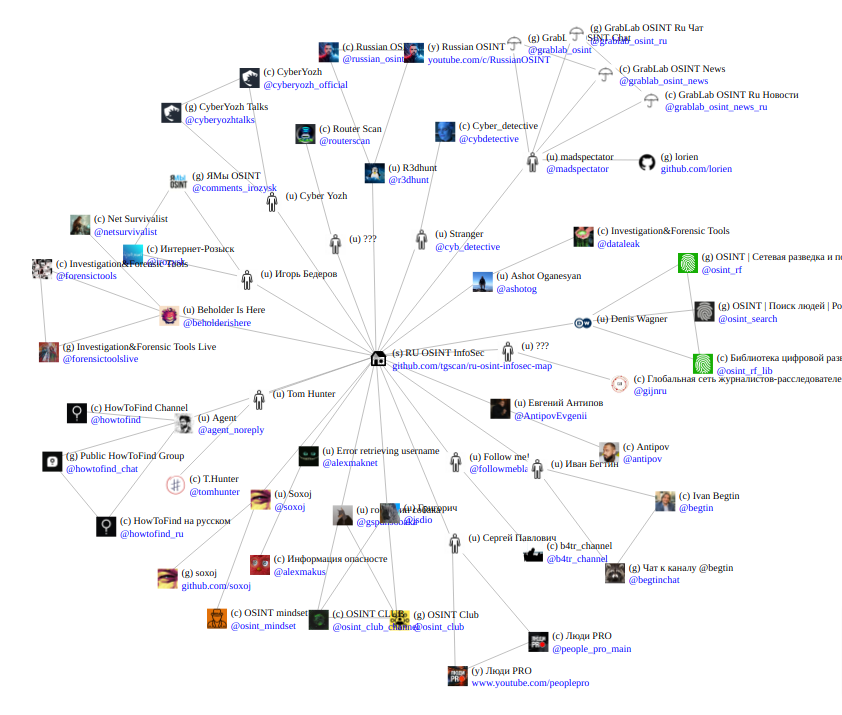

# Map of Russian OSINT and Infosec Resources

This is just-for-fun online map of Russian OSINT and InfoSecurity resources: authors, telegram channels, telegram groups, youtube channels, etc.

Rendered graph is available here https://lorien.github.io/ru-osint-infosec-map/ This web page is rendered automatically with github pages engine and is linked to "index.html file in this repository.

## How to submit new data or fix?

Just create a new issue in github project.
